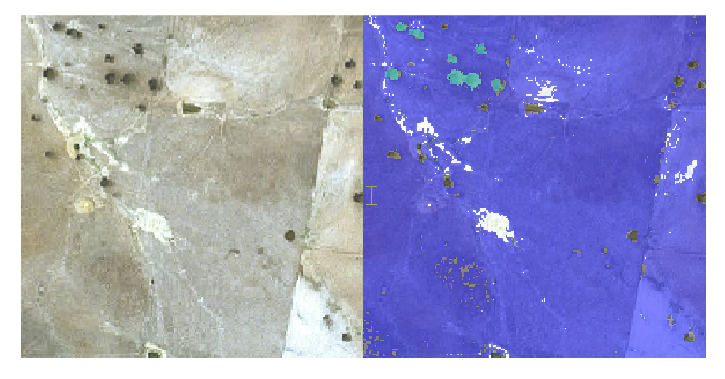

# Semantic Segmentation of Large Satellite Images 

Semantic segmentation of large multi-resolution satellite imagery tiles is ideally
suited to blockedImage workflows - where only part of the image is loaded for
training at one time.  This is a much faster workflow as the size of the tiles
can be tuned to fit within GPU RAM.

This example walks through the process of:
1. Importing a pre-labelled groundMATLAB Worksheet examples of Algo.7z truth object
2. Modifying the paths of the ground truth to match this training machine
3. Converting the large satellite images to blockedImageDatastores
4. Building and training, with validation, a semantic segmentation network on blockedImages
5. Testing on out of sample data that was not used in the training set.

## Data Acknowledgement
The satellite data used in this example is based on SPOT 6/7 Imagery and is reused from the [New South Wales Spatial Data Portal](https://portal.spatial.nsw.gov.au/portal/home/item.html?id=95c0763e95df425abc75ad52e2b35c94) and is licensed under a Creative Commons Attribution 3.0 License with additional acknowledgement to Airbus (&copy; CNES (2020) DISTRIBUTION AIRBUS DS) as the original provider of the data to the NSW Government.

## Setup 
To run open and execute buildAndTrainNet.mlx.

If you have moved the two data folders:

1. dataRaw
2. dataLabels

Outside the MATLAB Project folder you will have to change lines 7 and 11,
respectively to point to the new data folder locations.

### MathWorks Products (http://www.mathworks.com)

Requires MATLAB release R2021b or newer
- [Computer Vision Toolbox&trade;](https://au.mathworks.com/products/computer-vision.html)
- [Deep Learning Toolbox&trade;](https://au.mathworks.com/products/deep-learning.html)
- [Image Processing Toolbox&trade;](https://au.mathworks.com/products/image.html)

## License
The license for <insert repo name> is available in the [LICENSE.TXT](LICENSE.TXT) file in this GitHub repository.

## Community Support
[MATLAB Central](https://www.mathworks.com/matlabcentral)

Copyright 2021-2023 The MathWorks, Inc.
